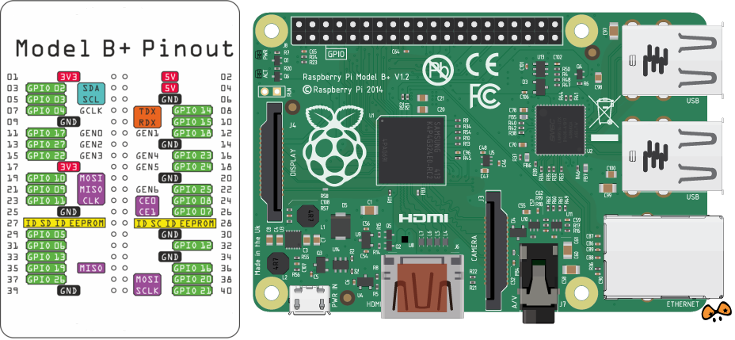
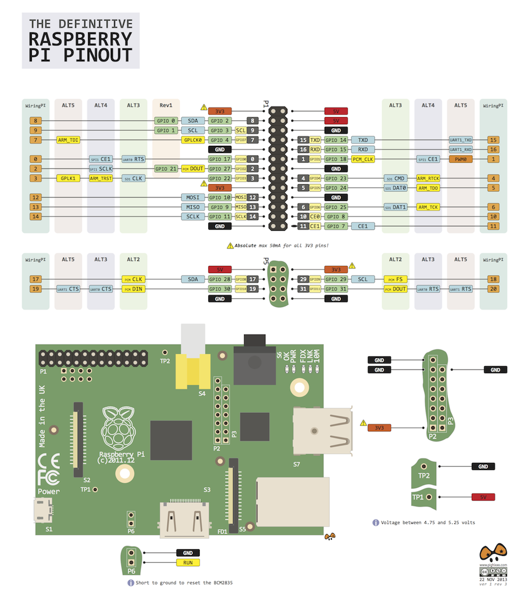

#WiringPi

##What is WiringPi?

**WiringPi** is a C library that **provides easy access to the Raspberry Pi GPIO** system. It’s designed to provide similar functionality to the Wiring package, core of the Arduino input/ouput system. The library **supports the UART port, SPI, I2C and PWM**.

In the [project page](http://wiringpi.com/reference/) you will find additional information.

##How to use it with Biicode.

First, [Download](https://www.biicode.com/downloads) and [Install](http://docs.biicode.com/c++/installation.html) **biicode**

There are more examples in the biicode's official documentation.

###Open the biicode's version

	~/$ bii init wiringpi_project
    ~/$ cd wiringpi_project
    ~/wiringpi_project$ bii open david/WiringPi
    ~/wiringpi_project$ bii cpp:build
    ~/wiringpi_project$ ./bin/executable_name_you_want

###Use the last GitHub version:

	~/$ bii init wiringpi_project
    ~/$ cd wiringpi_project/blocks
    ~/wiringpi_project/blocks$ mkdir [USER_NAME]
    ~/wiringpi_project/blocks$ cd [USER_NAME]
    ~/wiringpi_project/blocks/[USER_NAME]$ git clone https://github.com/davidsanfal/WiringPi.git
    ~/wiringpi_project/blocks/[USER_NAME]$ bii cpp:build
    ~/wiringpi_project/blocks/[USER_NAME]$ cd ~/wiringpi_project
    ~/wiringpi_project$ ./bin/executable_name_you_want

##Raspberry Pi GPIO Layout

###Raspberry Pi B+ and 2

###Raspberry Pi A/B

##Official info

Please note that the official way to get wiringPi is via git from git.drogon.net.

	git clone git://git.drogon.net/wiringPi

Please see

http://wiringpi.com/

for the official documentation, etc. and the best way to submit bug reports, etc.
is by sending an email to projects@drogon.net

Thanks!

-Gordon